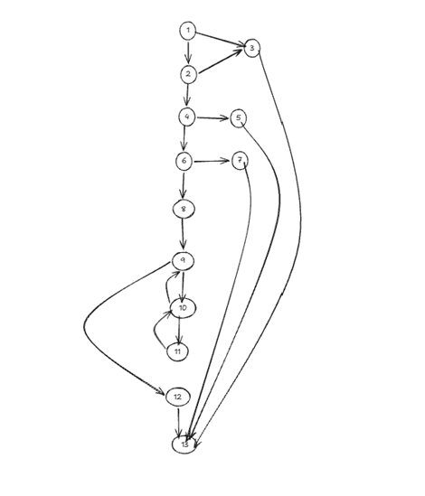
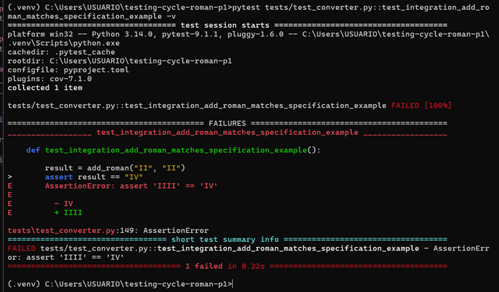
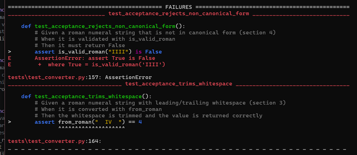
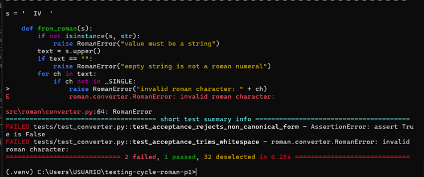
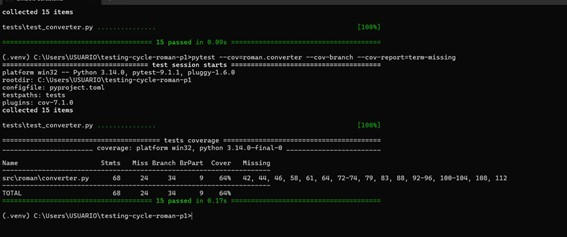
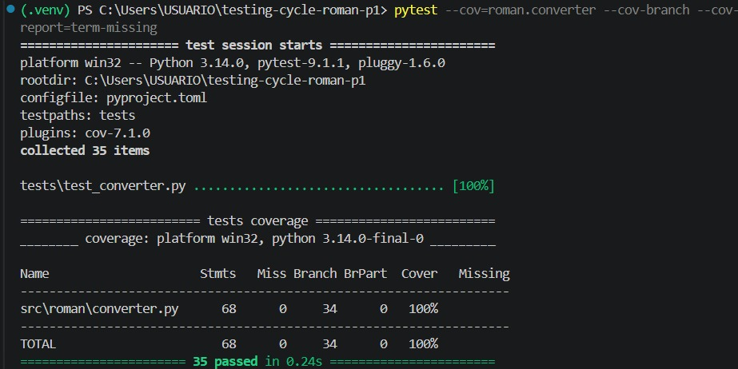

# Testing cycle

**Name:** Aragón Intriago Shirley Yamel


---

## 1. Control flow graph of `to_roman`



**Cyclomatic complexity**

- E = 18
- N = 13
- V(G) = E − N + 2 = 18 − 13 + 2 = **7**

**Basis set of V(G) linearly independent paths**

- Path 1: 1->3->13
- Path 2: 1->2->3->13
- Path 3: 1->2->4->5->13
- Path 4: 1->2->4->6->7->13
- Path 5: 1->2->4->6->8->9->12->13
- Path 6: 1->2->4->6->8->9->10->9->12->13
- Path 7: 1->2->4->6->8->9->10->11->10->9->12->13

**Definition-Use Table**

**Variable: n**

| Definition (node) | Use (node) | Type |
|---|---|---|
| 1 | 1 | p-use |
| 1 | 2 | p-use |
| 1 | 4 | p-use |
| 1 | 6 | p-use |
| 1 | 8 | c-use |

**Variable: out**

| Definition (node) | Use (node) | Type |
|---|---|---|
| 8 | 11 | c-use |
| 8 | 12 | c-use |

**Variable: remaining** (redefined inside the loop)

| Definition (node) | Use (node) | Type |
|---|---|---|
| 8 | 10 | p-use |
| 8 | 11 | c-use |
| 11 | 10 | p-use |
| 11 | 11 | c-use |

**Variable: value**

| Definition (node) | Use (node) | Type |
|---|---|---|
| 9 | 10 | p-use |
| 9 | 11 | c-use |

**Variable: symbol**

| Definition (node) | Use (node) | Type |
|---|---|---|
| 9 | 11 | c-use |


---

## 2. Integration finding

**Test:** `test_integration_add_roman_matches_specification_example`

```python
def test_integration_add_roman_matches_specification_example():
    # ESPECIFICACION.md section 7: add_roman("II", "II") must be "IV"
    result = add_roman("II", "II")
    assert result == "IV"
    assert is_valid_roman(result) is True
```

**Execution result**


**Defect found:** `add_roman("II", "II")` returned `"IIII"` instead of the specified
`"IV"` (ESPECIFICACION.md, section 7).

**Root cause:** the `_PAIRS` tuple in `converter.py` contained a duplicate entry
`(5, "IV")` where it should have contained `(4, "IV")`. Because the tuple is scanned
in order and `(5, "V")` comes right before it, `remaining` is always below 5 by the
time `(5, "IV")` is reached, so that entry can never fire. As a result, `to_roman(4)`
(and any value whose remainder is 4, e.g. 14, 1994) never produced the canonical
subtractive form and fell back to four repeated `"I"` symbols instead.

**Why the unit tests did not catch it:** `to_roman` had reached 100% branch coverage
before this defect was found, but branch coverage only guarantees that every branch
was executed at least once — it does not guarantee that every specific input value
was exercised. `to_roman(3)` and `to_roman(4)` walk through exactly the same branches
(the same `for`/`while` structure), so achieving full branch coverage never required
calling `to_roman` with the specific argument `4`. The defect lived in a **data
value** inside `_PAIRS`, not in an untested branch, so no amount of branch coverage
could expose it on its own. It only surfaced once two units were combined: `add_roman`
calls `from_roman("II") + from_roman("II")`, producing the intermediate value `4`,
which is precisely the value that triggers the faulty entry in `_PAIRS`. Each unit
in isolation (`from_roman("II")` returning `2`, or a `to_roman` call that happened
never to land on 4) looked correct on its own; the defect only became observable
through the collaboration between the two units.

---

## 3. Acceptance criteria

### Criterion 1: Canonical form rejection

**Given** a roman numeral string that is not in canonical form
**When** it is validated with `is_valid_roman`
**Then** it must return `False`

**Test:** `test_acceptance_rejects_non_canonical_form`
**Result:** FAILED (before the fix)



```
assert is_valid_roman("IIII") is False
AssertionError: assert True is False
 +  where True = is_valid_roman('IIII')
```

**Why coverage cannot reveal this:** `is_valid_roman` and `from_roman` already had
100% branch coverage before this test was written. Coverage measures whether every
branch in the code executed, not whether the function's output is functionally
correct against the specification. `from_roman("IIII")` walks through exactly the
same branches as `from_roman("III")` — the same character-validation loop, the same
subtractive-pair check — so full branch coverage was already achieved without ever
checking whether the input was in canonical form. The missing rule (section 4 of
the specification: canonical form only) was never encoded as a branch in the
original code at all, so there was no branch for coverage to measure in the first
place; coverage can only report on code that exists, not on a validation rule the
code never implemented.

### Criterion 2: Whitespace trimming

**Given** a roman numeral string with leading/trailing whitespace
**When** it is converted with `from_roman`
**Then** the whitespace is trimmed and the value is returned correctly

**Test:** `test_acceptance_trims_whitespace`
**Result:** FAILED (before the fix)



```
assert from_roman("  IV  ") == 4
roman.converter.RomanError: invalid roman character:
```

**Why coverage cannot reveal this:** the missing `.strip()` call is not an
unexecuted branch — it is a statement the specification required (section 3) that
was simply absent from the implementation. Branch coverage can only report on
branches that exist in the source; it has no way to detect the absence of a
requirement that was never written into the code in the first place. A function can
have 100% branch coverage and still be missing entire pieces of required behaviour,
as long as none of the existing branches depended on that missing behaviour.

### Criterion 3: Roman arithmetic result validity

**Given** two valid roman numerals
**When** they are added with `add_roman`
**Then** the result must be canonical and accepted by `is_valid_roman`

**Test:** `test_acceptance_add_roman_result_is_canonical`
**Result:** PASSED

```python
def test_acceptance_add_roman_result_is_canonical():
    result = add_roman("IV", "VI")
    assert result == "X"
    assert is_valid_roman(result) is True
```

---

## 4. Coverage

**Before:** 64% branch coverage



```
Name                     Stmts   Miss Branch BrPart  Cover   Missing
--------------------------------------------------------------------
src\roman\converter.py      68     24     34      9    64%   42, 44, 46, 58, 61, 64,
72-74, 79, 83, 88, 92-96, 100-104, 108, 112
--------------------------------------------------------------------
TOTAL                       68     24     34      9    64%
```

**After:** 100% branch coverage



```
Name                     Stmts   Miss Branch BrPart  Cover   Missing
--------------------------------------------------------------------
src\roman\converter.py      68      0     34      0   100%
--------------------------------------------------------------------
TOTAL                       68      0     34      0   100%
===================================== 31 passed in 0.23s =====================================
```
